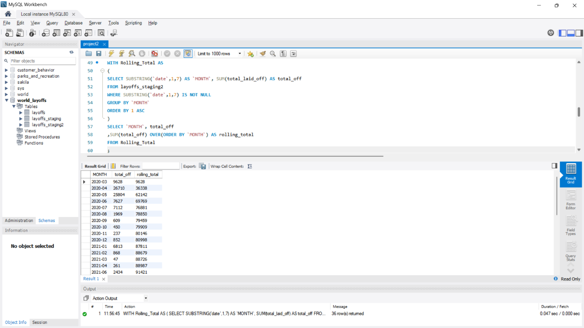

# 📊 MySQL Layoffs Exploratory Data Analysis

A MySQL exploratory data analysis project analyzing global layoffs to uncover patterns across companies, industries, countries, time periods, and funding stages.

## 🎯 Objective

Explore the cleaned layoffs dataset to understand:

- Layoff patterns across companies and industries
- Countries and years with the highest layoffs
- Monthly and yearly layoff trends
- Companies with the highest layoffs
- Layoffs across different funding stages

## 🛠️ Tools Used

MySQL

## 🔄 Workflow

Cleaned Layoffs Data → SQL Queries → Exploratory Analysis → Trend & Ranking Analysis

## 🔍 SQL Techniques Used

- Aggregate functions with `SUM()` and `MAX()`
- `GROUP BY` and `ORDER BY`
- Date functions with `YEAR()`
- String functions with `SUBSTRING()`
- Common Table Expressions (CTEs)
- Window functions
- `DENSE_RANK()`
- Rolling totals using window functions

## 📈 Analysis Performed

- Identified companies with the highest total layoffs.
- Analyzed layoffs by industry, country, and funding stage.
- Examined yearly and monthly layoff trends.
- Calculated cumulative monthly layoffs using rolling totals.
- Ranked the top 5 companies by layoffs for each year using `DENSE_RANK()`.

## 📁 Project Files

- `project2.sql` — MySQL queries used for exploratory analysis
- `layoffs.csv` — layoffs dataset used for the analysis

## 📸 Project Preview

